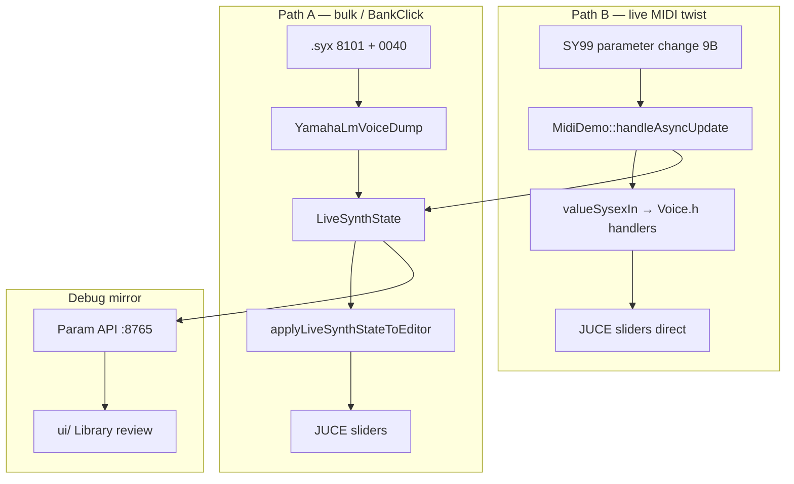

# SY99 / Sysex77 — Architecture Index

**Читать первым** после [`00_SPEC.md`](00_SPEC.md). Детали аудита конфликтов K1–K7: [`SPRINT_1a_rules_audit.md`](SPRINT_1a_rules_audit.md).

---

## 1. Project Rules (inline)

### R-NEW — добавленные правила

| ID | Правило |
|----|---------|
| **R-NEW-1** | Новый `.h` / global callback — **только** после sprint gate + запись в decision log ([`SYM7_library_sync_progress.md`](SYM7_library_sync_progress.md)). |
| **R-NEW-2** | Правка `YamahaLmVoiceDump` / parse offset — `_validate_*.py` **PASS до и после**. |
| **R-NEW-3** | Bulk field map — **только** в `sy99_param_bindings.json`; не третий hardcoded list (`REGISTRY_BULK_READ`, дубль в `Sy99LibraryBulkRead.h`). |
| **R-NEW-4** | React `apiFetch`: пути `/library/...`, **не** `/api/library/...` (base URL уже `/api`). |
| **R-NEW-5** | Registry params (37 confirmed): inbound → `LiveSynthState` + `applyLiveSynthStateToEditor`; `valueSysexIn` = **legacy only** (unify = Sprint 8). |
| **R-NEW-6** | Library nav: bank math **только** [`Sy99LibraryNavigation.h`](../Sysex77-master/Source/Sy99LibraryNavigation.h) — не дублировать в Librairie / MidiDemo / VoicesTableModel. |
| **R-NEW-7** | Library API read path = тот же resolve 0040, что JUCE ingest (Sprint 3). |

### R-KEEP — сохранять

| ID | Правило |
|----|---------|
| **R-KEEP-1** | Throttle ≤30 msg/s, echo guard ~50 ms — `MidiSysex.h` / `MidiDemo.h`. |
| **R-KEEP-2** | Адреса live SysEx — [`09_confirmed_addresses.md`](09_confirmed_addresses.md); **не** `MIDI_MAP_OBSERVATIONS.md`. |
| **R-KEEP-3** | Bank math — **только** `Sy99LibraryNavigation.h`. |
| **R-KEEP-4** | Один param за итерацию + fixture PASS — [`library_binding_workflow.md`](library_binding_workflow.md). |
| **R-KEEP-5** | Minimal patch; не рефакторить без нужды. |
| **R-KEEP-6** | Review → agent → bindings **вручную** (не auto-promote). |
| **R-KEEP-7** | EFSDLV elmode 4/8: authoritative **0040 @100/@104**; 8101 @efln+12 = poison/fallback. |
| **R-KEEP-8** | Synth nav (сценарии 3, 4) **never blocked** by 0040 fetch / `requestSysex`. |
| **R-KEEP-9** | Три слота данных: **live** / **8101** / **0040** — не сливать в один буфер. |
| **R-KEEP-10** | Review draft: sessionStorage + server JSON; закрытие отчёта **вручную**. |
| **R-KEEP-11** | Новые registry params: inbound только `LiveSynthState` + apply; **не** расширять `valueSysexIn` handlers. |

### Идея проекта

| Слой | Роль | Authoritative? |
|------|------|----------------|
| **JUCE Sysex77** | Продукт: editor, Librairie, MIDI, parse, LiveSynthState | **Да** — runtime |
| **React `ui/` + Param API :8765** | Debug: catalog, Library review, bindings visibility | **Нет** — mirror |
| **Fixtures `_validate_*.py`** | Gate перед изменением parse/registry | **Да** — regression |
| **`sy99_param_bindings.json`** | Offsets + bindStatus (37 registry) | **Да** — bindings |
| **`03_parameter_map.csv`** | Audit / tracker (~183 строк) | **Нет** — docs only |

---

## 2. Agent Decision Tree

```
Задача                          → Куда
─────────────────────────────────────────────────────────
Metadata / bindStatus / catalog → sy99_param_bindings.json (+ ui/fixtures copy)
Parse offset / lm* fields       → YamahaLmVoiceDump + Sy99ParamRegistry + fixtures
Editor slider / TX (registry)   → Voice.h + applyLiveSynthStateToEditor (не valueSysexIn)
Editor slider / TX (legacy)     → Voice.h / Pan.h + MidiSlider + valueSysexIn
Library inDump / green dot      → Sy99LibraryApi (read), не отдельный parser
Navigation / slot A1–D16        → Sy99LibraryNavigation.h ONLY
Library review notes            → UI review → JSON; promote в bindings вручную
React Library / review UI       → ui/ (debug mirror); см. ui/README.md
Новый async слой / callback     → STOP → sprint gate + decision log
```

**Authoritative tables** (не дублировать новой «главной» таблицей):

| Роль | Файл |
|------|------|
| Bindings (37 registry) | [`fixtures/sy99_param_bindings.json`](fixtures/sy99_param_bindings.json) |
| Bulk offsets docs | [`lm_8101_offsets.md`](lm_8101_offsets.md) |
| Runtime enum + codec | [`Sy99ParamRegistry.cpp`](../Sysex77-master/Source/Sy99ParamRegistry.cpp) `kMetaTable` |
| Audit tracker | [`03_parameter_map.csv`](03_parameter_map.csv) |

---

## 3. Data flow (inbound paths)



**Риск рассинхрона:** path B обновляет widget **мимо** state для legacy params; registry params должны идти через state (R-NEW-5, R-KEEP-11). Unify inbound = Sprint 8 (gate: 2 недели после Sprint 5 + 20 params).

---

## 4. Восемь HW-сценариев

Checklist в [`TEST_STATUS.md`](../TEST_STATUS.md). Кратко:

| # | Сценарий | Триггер | Shared state |
|---|----------|---------|--------------|
| 1 | Клик Librairie | listBox click | `gLiveSynthState`, `bankSelectedVoiceIndex` |
| 2 | Outbound recall | tab/slot/◀▶ | `libraryRecallContext` |
| 3 | Inbound PC | SY99 ch1 PC | `libraryInboundCommittedState` |
| 4 | Synth panel nav | unsolicited 8101VC | abort pending 0040 fetch |
| 5 | Full library sync | menu #30–#32 | `requestSysex`, transport RX |
| 6 | Live voice read | Voice tab Sync | `gRequestLiveVoiceRead` — **reset state** |
| 7 | Manual dump RX | FROM SY99 | `requestSysex`, `arraySysex` |
| 8 | Invoke load | menu #14/#15 | probe only, not production |

**Не ломать:** (3)(4) never blocked by 0040; inbound PC suppresses outbound 300ms; live read reset уничтожает BankClick progress; full sync owns transport RX.

---

## 5. Resolve exceptions (не полная param table)

| Param / зона | Условие | Authoritative source | Fallback / poison |
|--------------|---------|----------------------|-------------------|
| **EFSDLV E1/E2** | elmode **4** или **8** | **0040 @100 / @104** | 8101 @efln+12 — poison (NiteHwk: 76≠127) |
| **EFLN E1/E2** | elmode **4** или **8** | **0040 @99 / @103** (wire masked) | 8101 El.1 @ elvl+35 only; **no El.2←El.1 mirror** |
| **EFSDLV E1/E2** | elmode 1,2,6,7,9 | 8101 bulk | — |
| **OUTSEL E1** | elmode 1,4,6,8 | strip byte @ ELVL+1 (bits 1–2) | bit 0 may carry ELDT when shared |
| **OUTSEL E1 reconcile** | elmode 4/8 + E2 anchor | `reconciledOutselE1Bulk8101` | E2 anchor if E1 strip differs |
| **EFSDVSNS / EFSDSCL El.2** | — | live param9 only | bulk8101 offset TBD (HW test; no mirror) |
| **WPBR, ATPBR, …** | common tail | **0040VC** bulk | — |

Детали байтов: [`lm_8101_offsets.md`](lm_8101_offsets.md). Regression: `_validate_efsdlv_elmode4.py`, `_validate_bulk_parse.py`.

---

## 6. DO NOT EXTEND (без sprint gate)

- Новые `.h` для BankClick / lazy 0040 / invoke orchestration
- Global callbacks поверх `requestSysex` (merge = Sprint 5.4 **после** 5.2a HW log)
- Третий bulk field map (Python `REGISTRY_BULK_READ`, дубль в C++)
- «11 хранилищ по ELMODE» — один `LiveSynthState` + resolve rules
- Auto-promote Library review → bindings / C++
- Новая «главная» param table (дублирует bindings + lm_8101_offsets + kMetaTable)

---

## 7. ELMODE-CHANGE protocol

Любая правка **ELMODE**, `resolveParam`, lazy 0040 skip blocks, effect-send visibility:

1. Fixtures **PASS:** `_validate_efsdlv_elmode4.py` + `_validate_bulk_parse.py`
2. HW: минимум **2 голоса** — elmode **4** (NiteHwk A7) и elmode **8** (ANONIM или EP|GrnDual)
3. **Один PR = одна зона** — не менять ELMODE routing и BankClick lazy в одном PR
4. Запись в `TEST_STATUS.md`

---

## 8. Sprint 2 HW smoke matrix (path B)

**Фиксированные слоты — не подменять «похожим» голосом.**

| Param | Слот | Голос | mm | elmode | Fixture | Проверка |
|-------|------|-------|-----|--------|---------|----------|
| ELVL | A1 | ANONIM | `00` | 8 (fixture) / **6 (HW LCD)** | `01_init_anonim_07x1_voice.syx` | slider == `/api/dump/current` |
| WPBR | A1 | ANONIM | `00` | same | same | 0040 common tail |
| OUTSEL E1 | A1 | ANONIM | `00` | strip baseline | same | прямое чтение strip byte |
| OUTSEL E1 | **A7** | **EP:NiteHwk** | **`06`** | **4** | `baseline_ep_nitehwk_voice.syx` | E2 reconcile; EFSDLV **127/100** |

**Известный drift:** fixture `01` elmode=8, HW log ANONIM elmode=6 — на железе сверять LCD.

Gate Sprint 2: все `_validate_*.py` PASS + эта matrix задокументирована в TEST_STATUS.

---

## 9. Checklists

### Anti-duplication (перед merge)

- [ ] Не дублирую bulk field map (есть запись в bindings.json)?
- [ ] Не дублирую bank math (`Sy99LibraryNavigation`)?
- [ ] Не добавляю второй inbound path для registry param (R-KEEP-11)?
- [ ] Не добавляю `.h`/callback без decision log (R-NEW-1)?
- [ ] Прогнал `_validate_*.py` если трогал parse/registry (R-NEW-2)?
- [ ] React API path без двойного `/api` (R-NEW-4)?
- [ ] Новый param — один codec path (registry encode/decode, не третий в Voice.h)?

### PROMOTE (review → editor)

Review отчёт **≠** автоматический fix. Явные шаги:

1. **Review OK** в UI (`/library/.../:mm?review=`) — сверка UI/8101/0040 с LCD
2. **`bindStatus`** → `confirmed_bulk8101` / `confirmed_bulk0040` в `sy99_param_bindings.json`
3. **C++ promote** (если нужно): `kMetaTable` + parse/apply в registry
4. **Editor bind:** `Voice.h` + `applyLiveSynthStateToEditor` (registry) или MidiSlider (legacy)
5. **Fixtures PASS** + строка в `TEST_STATUS.md`
6. **Закрыть отчёт** вручную (не auto-delete)

Подробнее: [`library_binding_workflow.md`](library_binding_workflow.md) §6–8, [`library_reviews/README.md`](library_reviews/README.md).

---

## 10. Fixture regression bundle (Sprint 2 gate)

```bash
python _agent_context/fixtures/_validate_bulk_parse.py
python _agent_context/fixtures/_validate_0040_bulk.py
python _agent_context/fixtures/_validate_efmode_bulk.py
python _agent_context/fixtures/_validate_efsdlv_elmode4.py
python _agent_context/fixtures/_validate_library_bindings.py
python _agent_context/fixtures/_validate_paired_autosync.py
python _agent_context/fixtures/_test_library_navigation.py
```

Любой FAIL — stop до Sprint 3+ C++.

## 11. Sprint 4 nav gate (offline + HW checklist)

```bash
python _agent_context/fixtures/_run_sprint4_gate.py
```

20 tests in `_test_library_navigation.py` (includes `sy99HostSynthNavInSync` mirror). HW scenarios 1–4: [`TEST_STATUS.md`](../TEST_STATUS.md) Sprint 4.

---

*Sprint 1b — 2026-05-25. Master roadmap: plan `bankclick_consolidation`. Risk overlay: plan `risk_mitigation_roadmap`.*
