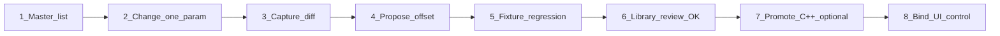

# Library binding workflow (manual → dump → validate → UI)

Итеративный алгоритм привязки параметров SY-99 к байтам bulk-дампа. Library показывает **полный** master-каталог; C++ `enum Id` расширяется только после подтверждения offset.

## Артеfactы

| Файл | Роль |
|------|------|
| `_agent_context/fixtures/sy99_master_catalog.json` | Все параметры из мануала (~214) |
| `_agent_context/fixtures/sy99_param_bindings.json` | Подтверждённые / candidate привязки (37 registry) |
| `scripts/generate-master-catalog.py` | Регенерация каталога из `sy99_sysex_complete.md` |
| `scripts/propose-binding-from-diff.py` | Diff before/after → candidate offset |

## Цикл (8 шагов)



### 1 — Master list

```bash
python scripts/generate-master-catalog.py
```

Копии пишутся в `_agent_context/fixtures/` и `ui/fixtures/`. В Library все строки видны; `bindStatus: manual_only` → `inDump: false`.

### 2 — Один параметр — один эксперiment

На SY-99 или в Sysex77: голос-fixture (ANONIM, CrsRock, EP:Classic), изменить **только один** параметр, сохранить / запросить dump.

### 3 — Capture diff

**Источники захвата:**

| Источник | Путь / команда | Когда использовать |
|----------|----------------|-------------------|
| SYM7 startup sync | `_agent_context/fixtures/sym7_captures/*.txt`, `*.syx` | Полная библиотека, порядок TX/RX |
| Sysex77 AUTOSYNC | `%AppData%/Application Support/Sysex77/captures/AUTOSYNC-VOICE64-*.syx` | 64 internal voices без SYM7 |
| Diff-fixtures | `04/05` OUTSEL, `06–08` EFMODE | Уже известные эталоны |
| Sysex77 log | `Sysex77_MIDI.log` + `_diff_8101.py` | Локальный diff 8101 mixer tail |

**SYM7:** см. [`fixtures/sym7_captures/README.md`](fixtures/sym7_captures/README.md) — Bulk Protect OFF, фиксированный Device ID, экспорт `.syx` или hex log в эту папку.

**AUTOSYNC:** Librairie → REQUEST VOICE → Auto-sync 64 internal → сравнить `AUTOSYNC-VOICE64-*.syx` с baseline FROM SY99.

Пары `before.syx` / `after.syx` должны отличаться минимально (один параметр).

### 4 — Propose offset

```bash
python scripts/propose-binding-from-diff.py before.syx after.syx ELDT
```

Скрипт читает `sy99_master_catalog.json`, diff-ит `8101VC` и `0040VC`, печатает candidate `frameOffset` и предлагаемый `bindStatus`.

Записать результат в `sy99_param_bindings.json`:

```json
{
  "id": "ELDT",
  "bindStatus": "candidate_bulk8101",
  "registryId": "ELDT",
  "bulkSource": "8101",
  "bulkRead": { "frame": "8101", "field": "lmEldtRaw", "perElement": true },
  "notes": "fixture diff 2026-05-23"
}
```

C++ читает `bulkRead` через `Sy99LibraryBulkRead.h` (Library API / `populateRegistryDumpFields`).

При необходимости добавить строку в `lcd_reference.csv`.

### 5 — Regression

```bash
python _agent_context/fixtures/_validate_bulk_parse.py
python _agent_context/fixtures/_validate_library_bindings.py
cd ui && npm run validate:catalog
```

37 core registry params не должны ломаться.

### 6 — Library review (gate)

1. Открыть `/library/.../:mm` в UI.
2. Фильтр **Bind → Candidate** или **Только с значением в дампе**.
3. Сверить колонки UI / 8101 / 0040 с LCD SY-99.
4. Отправить review (`?review=`) — см. [`library_reviews/README.md`](library_reviews/README.md).
5. После ✓ → `bindStatus: confirmed_bulk8101` или `confirmed_bulk0040`.

### 7 — Promote в C++ (не блокер Library)

- `kMetaTable` + `Id` enum
- `parseMixerTail8101` / `applyBulk8101FromParsed`
- Появление в `/api/dump/current`

### 8 — Bind UI (крутилки)

По `05_missing_audit.md`: `Voice.h`, `Pan.h`, `MidiSlider` + `valueSysexIn`.

## bindStatus в Library UI

| bindStatus | ● | Значение |
|------------|---|----------|
| `manual_only` | серый | Строка есть, `inDump: false` |
| `candidate_bulk8101` / `candidate_bulk0040` | жёлтый | raw из parser, нужна проверка |
| `confirmed_bulk8101` / `confirmed_bulk0040` | зелёный | fixtures + review OK |
| `confirmed_live` | зелёный | C++ registry + live sync |

## API

- `GET /api/library/pages/:page/voices/:mm` — `params[]` из master catalog + `catalogStats`
- `GET /api/library/catalog/stats` — глобальная статистика каталога

## Приоритет очереди (Common)

ELMODE → WOL → ELVL → ELDT → ELNS → ENLL → ENLH → EVLL → EVLH → OUTSEL → RNDP → WPBR → Effect → MCTUN → Mod depth → After Touch / Pan / Other (#230…).
